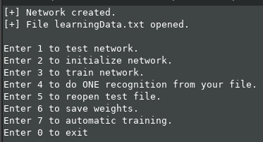

# Neural network to recognize handwritten numbers
This program allows you to initialize, train your network and do the "honest recognition".
 
### Usage

 
Let me explain you how to manage it. 
Press 1 to test newtork. You have to write how many tests you want to do. The programm will read data from learning file and try to recognize the number in the picture. 
Press 2 to initialize network. Neurons' weights will be read from the init file. 
Press 3 to start training. The program will read tests from the learning file, the network will try to guess the number and improve the result, if it's wrong. 
Press 4 to do honest recognition. You have to write the name of file that has an input data. 
Press 5 to reopen learning data file. It does NOT happen automatically!  
Press 6 to save networks' weights to file. You will be able to initialize them form file later. 
Press 7 to try automatic self-training. (Network will try to change it's structure to get better result. Very uneffective, but fully automatized. 
 
 
### Files
#### main.cpp 
Contains user menu.
#### betterthanmnist.h 
Reads pixels of image from file and the correct answer. Each pixel is a float number.
#### neuralnetwork.h 
Neural network class. Does recognition and backward pass.
#### timer.h 
Calculates time.
#### honestTest.txt
Contains pixels, but does not contain the answer. The neural network can't check itself, only try to guess the number.
#### init90.txt
Contains layer weights. You may initialize neural network from this file. It has about 90% accuracy.
#### learningData.txt
62MB file. Contains data to train and test neural network.
